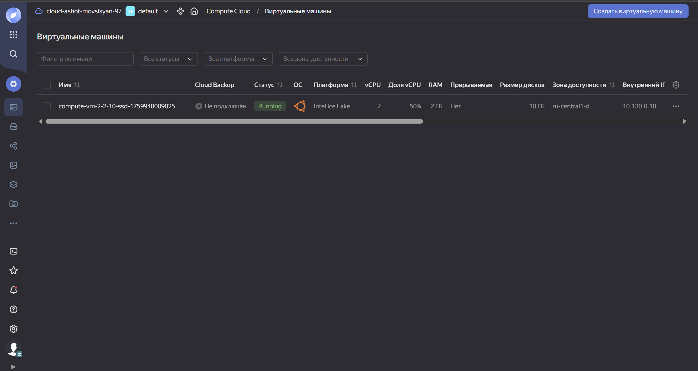
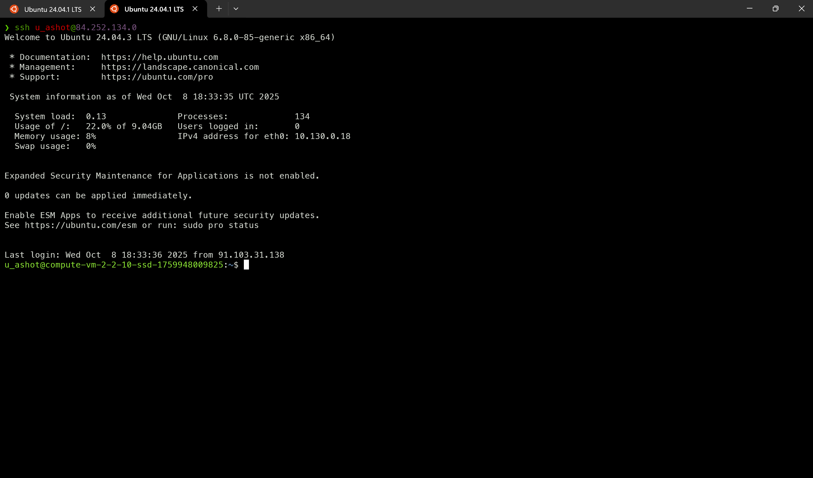
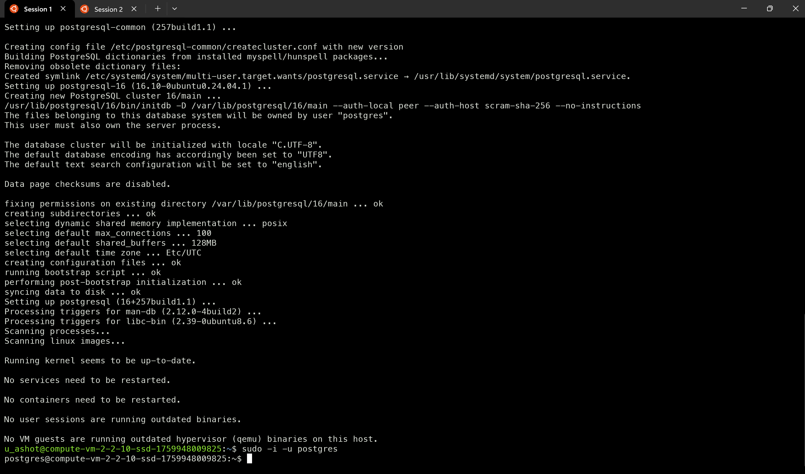
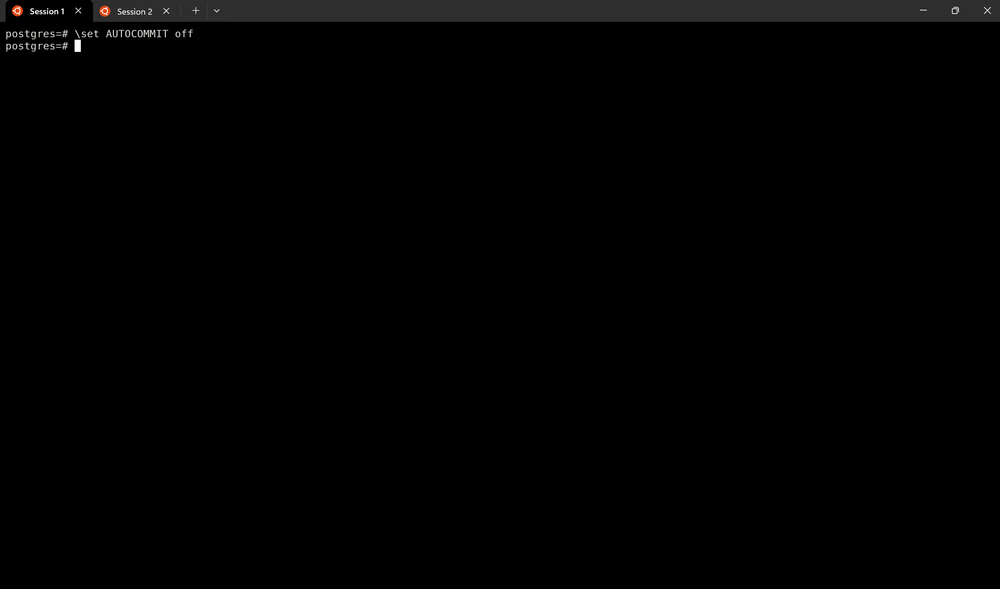
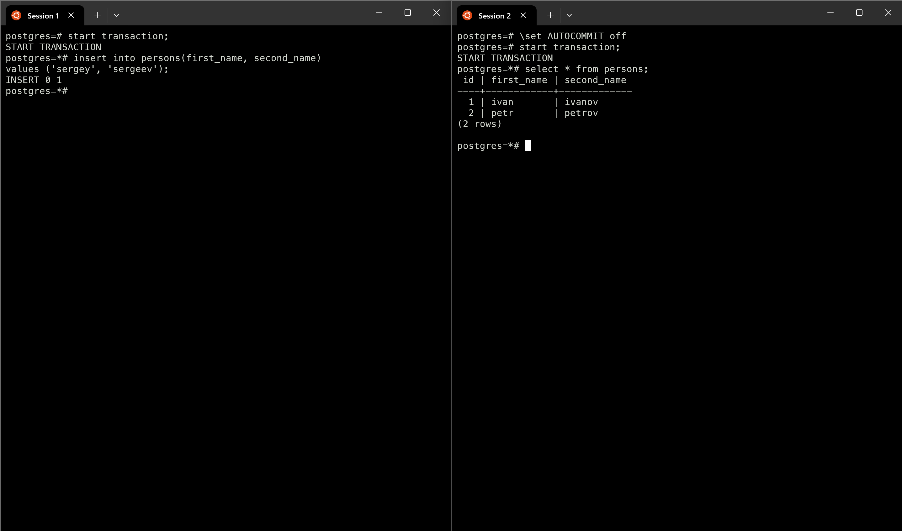
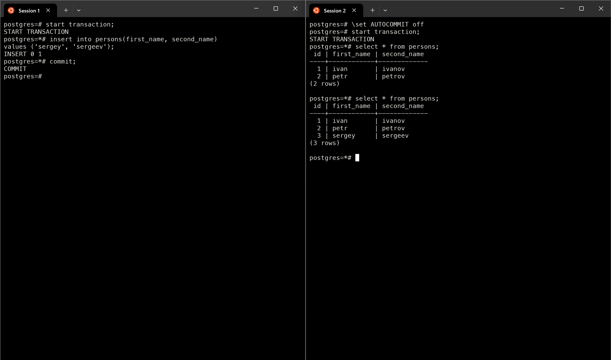
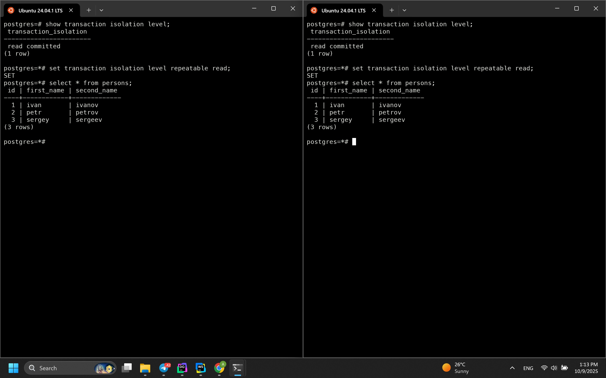
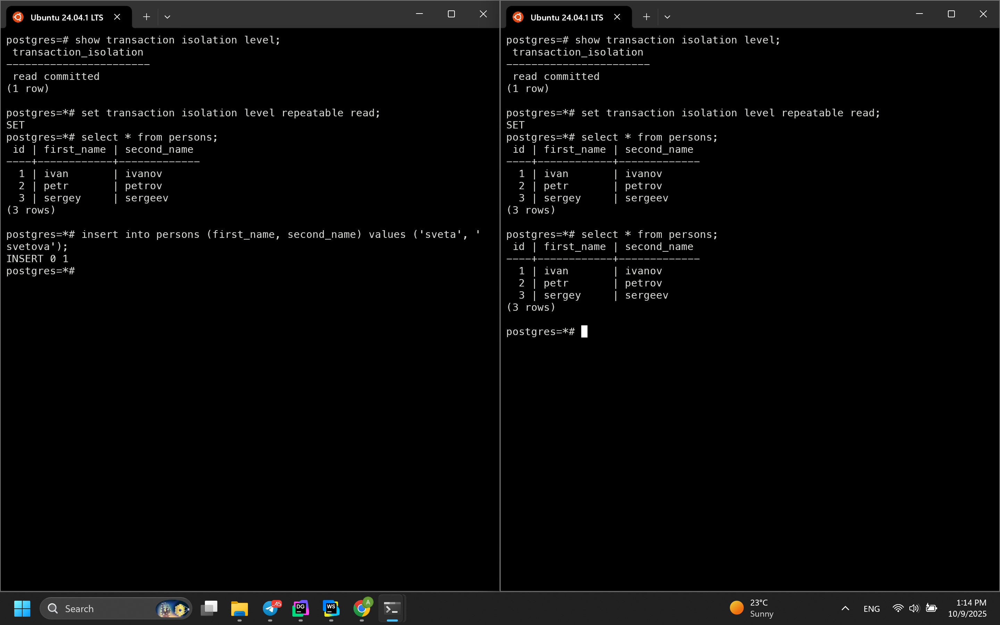
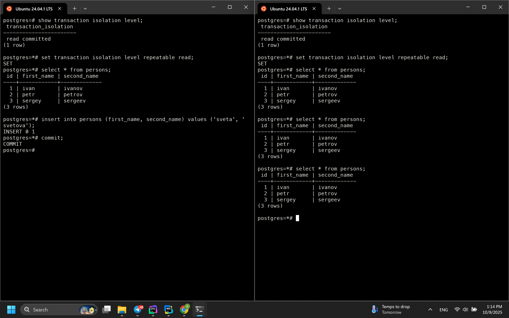
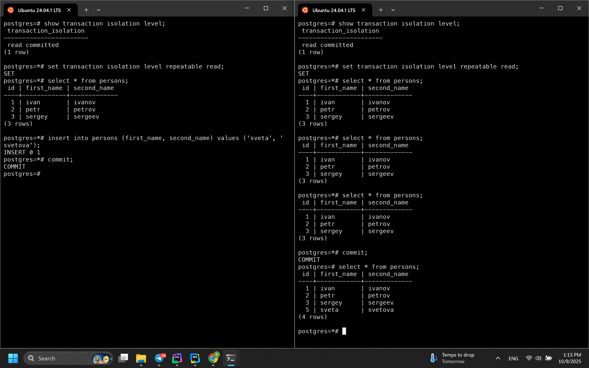

# №1 — Работа с уровнями изоляции транзакций в PostgreSQL

## Установка и подготовка среды

**Скриншоты:**

|        |  |
|-------------------------------------------------------------------|-------------------------------------------------------------------------|
|  |            |


## Задания

* в первой сессии новую таблицу и наполнить ее данными 
```postgresql
create table persons (
    id serial,
    first_name text,
    second_name text
);
insert into persons (first_name, second_name) values ('ivan', 'ivanov');
insert into persons (first_name, second_name) values ('petr', 'petrov');
commit;
```

* посмотреть текущий уровень изоляции: `show transaction isolation level`

команда: 
```postgresql
show transaction isolation level;
```
результат:
```txt
 transaction_isolation 
-----------------------
 read committed
(1 row)
```

* начать новую транзакцию в обоих сессиях с дефолтным (не меняя) уровнем изоляции
* в первой сессии добавить новую запись 
```postgresql
insert into persons (first_name, second_name) values('sergey', 'sergeev');
```
* сделать `select * from persons;` во второй сессии
* видите ли вы новую запись и если да то почему?

> Новые добавленные строки во второй сессии не видны, потому что уровень изоляции `READ COMMITTED` не позволяет видеть незафиксированные (`not commited`) изменения в других транзакциях.

* завершить первую транзакцию - `commit;`;
* сделать `select * from persons;` во второй сессии
* видите ли вы новую запись и если да то почему?


> Да, новая запись видна. После того как мы успешно завершили транзакцию в первой сессии, во второй сессии становится видна новая добавленная строка. При таком уровне изоляции можно читать только те данные, которые были зафиксированы до момента выполнения запроса `SELECT`.

* начать новые, но уже `repeatable read` транзакции - 
```postgresql
set transaction isolation level repeatable read;
```

Убедимся что уровень изоляции поставленно правильно.



* в первой сессии добавить новую запись 
```postgresql
insert into persons (first_name, second_name) values ('sveta', 'svetova');
```
* сделать `select * from persons` во второй сессии.


* видите ли вы новую запись и если да то почему?
> Новую строку не видно, потому что при таком уровне изоляции также нельзя читать незафиксированные данные. 

* завершить первую транзакцию - `commit;`
* сделать `select * from persons` во второй сессии


* видите ли вы новую запись и если да то почему?
> В этом случае мы также не видим новые данные, потому что при данном уровне изоляции транзакция работает с одним снимком данных, который создаётся в момент её начала и не изменяется до завершения транзакции.

* завершить вторую транзакцию - `commit;`
* сделать `select * from persons` во второй сессии


* видите ли вы новую запись и если да то почему?
> После завершения транзакции, при выполнении нового запроса для получения данных, мы уже имеем дело с новой транзакцией, в которой должны быть видны все зафиксированные изменения.


