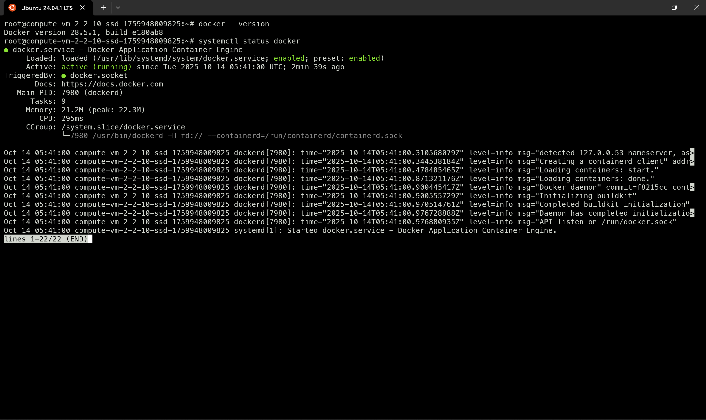
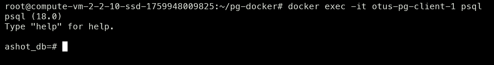
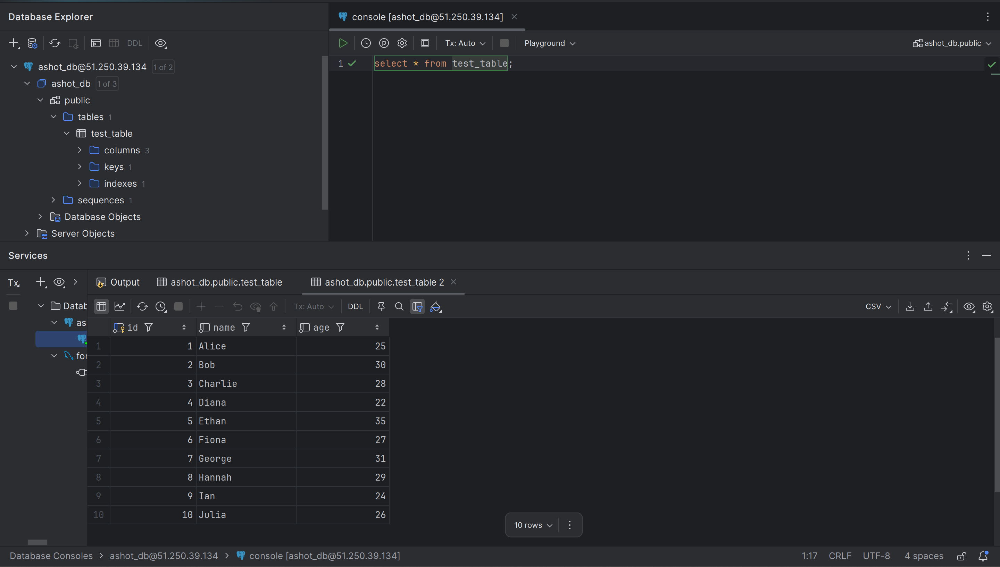
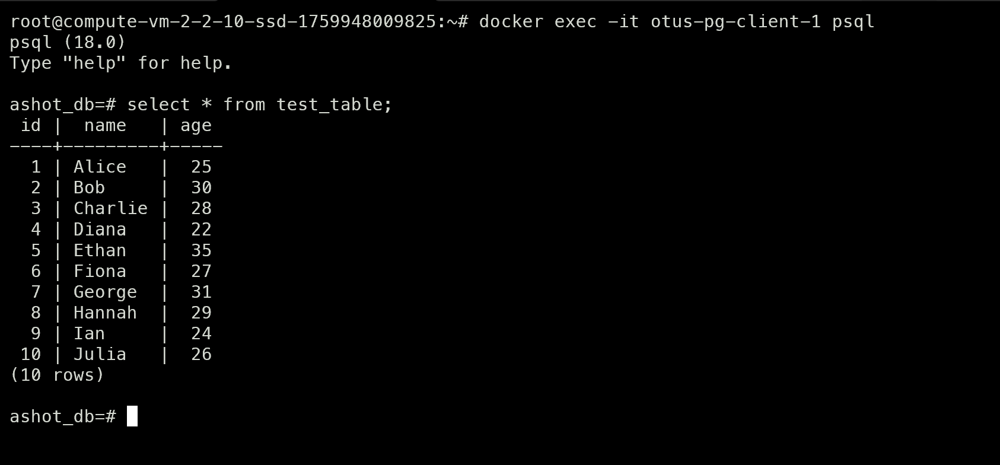

# №2 — Установка и настройка PostgteSQL в контейнере Docker

## Установка среды

Я выбрал ЯО для установки среды.
Для установки Docker воспользовался официальной статьёй [Install Docker Engine on Ubuntu](https://docs.docker.com/engine/install/ubuntu/).

> Все команды, приведённые ниже, выполнялись от имени пользователя `root` (`sudo su`).

**Скриншоты:**


После успешной установки Docker я создал каталог 
```bash
  mkdir /var/lib/postgres
```

Запуск сервера я выполнил с помощью команды docker compose.
Для этого в корневом каталоге была создана папка `pg-docker`, в которой находится файл конфигурации.
docker-compose.yml
```yml
name: "otus"

services:
  pg-server:
    image: postgres:${POSTGRES_VERSION:-18}-alpine
    environment:
      POSTGRES_USER: ${POSTGRES_USER}
      POSTGRES_PASSWORD: ${POSTGRES_PASSWORD}
      POSTGRES_DB: ${POSTGRES_DB}
      POSTGRES_INITDB_SKIP_TZINFO: "yes"
    healthcheck:
      test: [ "CMD-SHELL", "pg_isready -U $$POSTGRES_USER -d $$POSTGRES_DB -h 127.0.0.1 -p 5432" ]
      interval: 5s
      timeout: 3s
      retries: 10
      start_period: 10s

    volumes:
      - /var/lib/postgresql/:/var/lib/postgresql/
    ports:
      - 0.0.0.0:${POSTGRES_EXT_PORT:-5432}:5432
    networks:
      - pg_net

  pg-client:
    image: postgres:${POSTGRES_VERSION:-18}-alpine
    command: ["tail", "-f", "/dev/null"]
    environment:
      PGHOST: pg-server
      PGUSER: ${POSTGRES_USER}
      PGPASSWORD: ${POSTGRES_PASSWORD}
      PGDATABASE: ${POSTGRES_DB}
    depends_on:
      pg-server:
        condition: service_healthy
    healthcheck:
      test: [ "CMD-SHELL", "psql -c 'select 1' >/dev/null 2>&1 || exit 1" ]
      interval: 10s
      timeout: 5s
      retries: 5
      start_period: 5s
    tty: true
    stdin_open: true
    networks:
      - pg_net

networks:
  pg_net:
    driver: bridge
```
Параметры, такие как версия сервера PostgreSQL, имя пользователя, пароль и имя базы данных, я указал в файле `.env`.
Пример этих настроек приведён в файле `.env.example`.
```dotenv
POSTGRES_VERSION=
POSTGRES_USER=
POSTGRES_PASSWORD=
POSTGRES_DB=
```


* Для развёртывания контейнеров я запустил команду:
```bash
  docker compose up -d
```
С помощью команды docker ps -a можно просмотреть все запущенные и остановленные контейнеры.


* К базе данных я подключился из клиентского контейнера с помощью команды.
```bash
  docker exec -it otus-pg-client-1 psql
```



* Создал таблицу и заполнил её несколькими строками данных.

```sql
CREATE TABLE test_table
(
    id   SERIAL PRIMARY KEY,
    name VARCHAR(50) NOT NULL,
    age  INT         NOT NULL
);

INSERT INTO test_table (name, age)
VALUES ('Alice', 25)  , ('Bob', 30)
     , ('Charlie', 28), ('Diana', 22)
     , ('Ethan', 35)  , ('Fiona', 27)
     , ('George', 31) , ('Hannah', 29)
     , ('Ian', 24)    , ('Julia', 26)
;

SELECT * FROM test_table;
```


* Успешно подключился к базе данных через DataGrip, указав IP-адрес сервера, имя пользователя и пароль.
После подключения получил данные из созданной таблицы.


* Контейнеры были удалены с помощью команды.
```bash
  docker compose down -v 
```

* Контейнеры были пересозданы с помощью команды.
```bash
  docker compose up -d 
```

* Подключился к базе данных и выполнил команду `SELECT` — данные остались на месте.


