# №3 — Установка и настройка PostgreSQL


* Создал новую виртуальную машину с Ubuntu 24.04 LTS в ЯО.
* Установил на неё PostgreSQL 18 через `sudo apt`
* Запустил кластер.

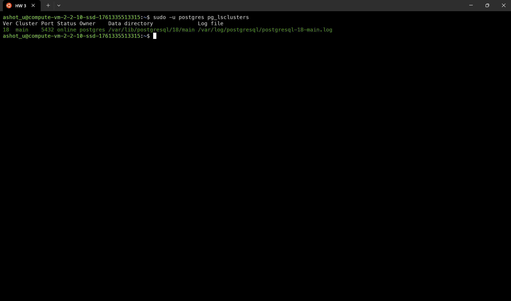

* Подключился к базе данных через `psql` и создал таблицу с данными.

```sql
create table test(c1 text);
insert into test values('1');
```

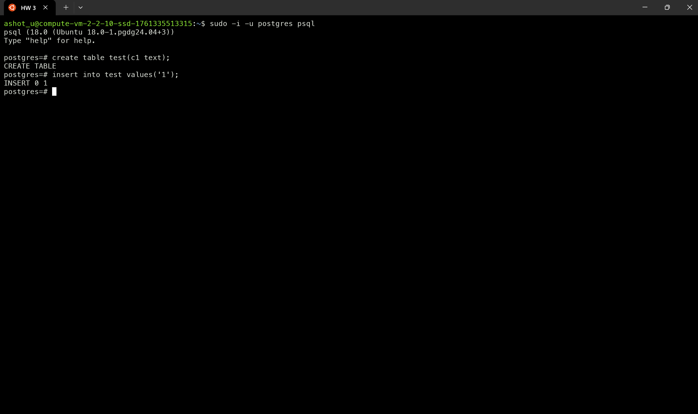

* Остановил PostgreSQL с помощью команды `sudo pg_ctlcluster 18 main stop`.

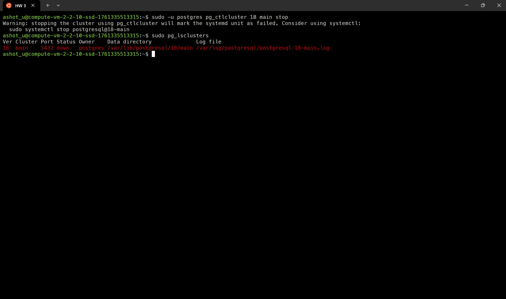

* Создал новый диск и подключил его к виртуальной машине. 

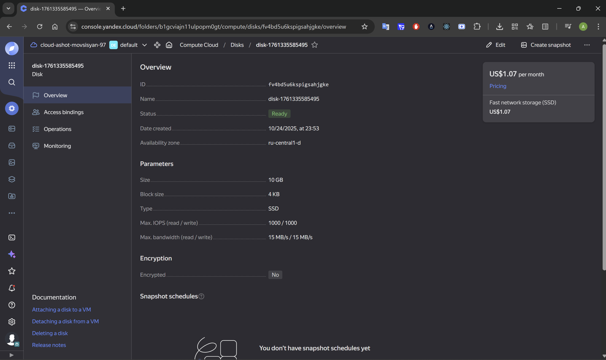

* Проинициализировал диск и подмонтировал файловую систему согласно инструкции по ссылке.
* Перезагрузил виртуальную машину — диск остался примонтированным.
* Изменил владельца каталога PostgreSQL с помощью команды `sudo chown -R postgres:postgres /mnt/data`.
* Перенёс содержимое с помощью команды `sudo mv /var/lib/postgres/18 /mnt/data/`.
* Попробовал запустить кластер `sudo pg_ctlcuster 18 main start`.

| 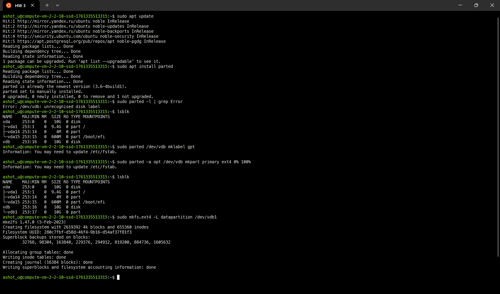 | 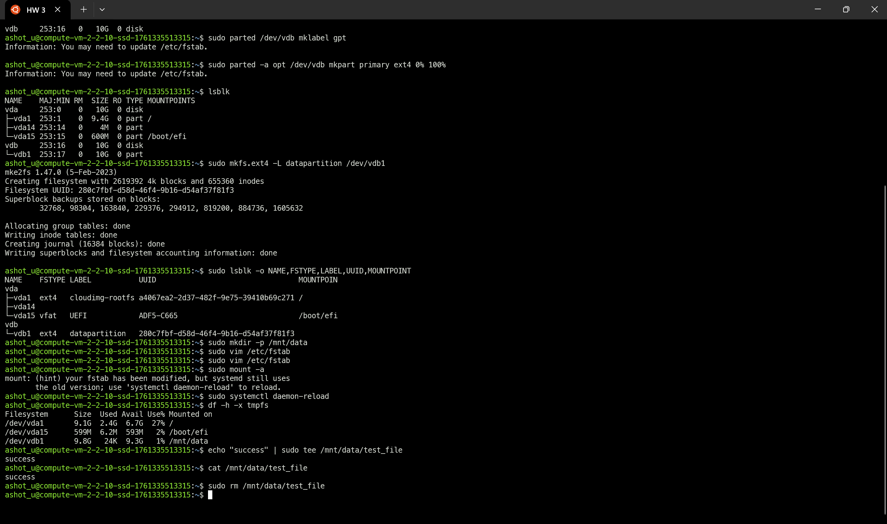 |
|------------------------------------------------|------------------------------------------------|
| 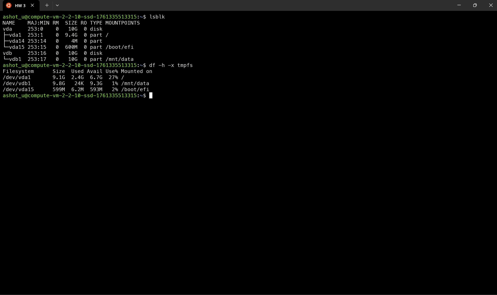 | 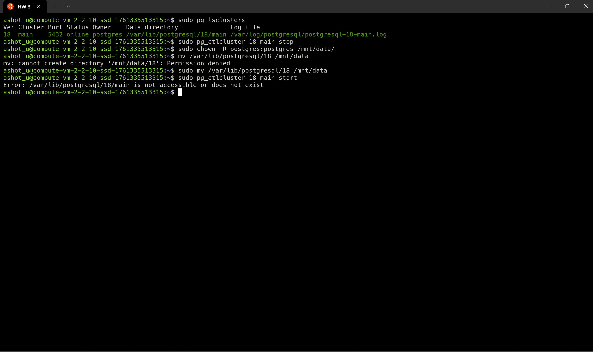 |

* Но появилась ошибка, так как в конфигурационном файле не изменён параметр `data_directory`.
* Параметр, который нужно изменить, находится в файле `/etc/postgresql/18/main/postgresql.conf`. Изменил значение строки на `data_directory = '/mnt/data/18/main'`.

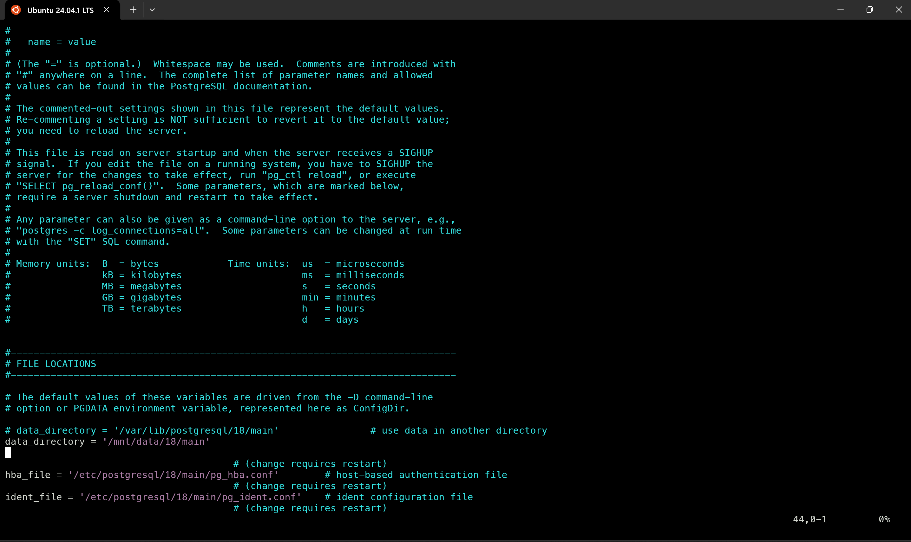

* После изменения параметра кластер успешно запустился.

```bash
sudo pg_ctlcluster 18 main start 
```

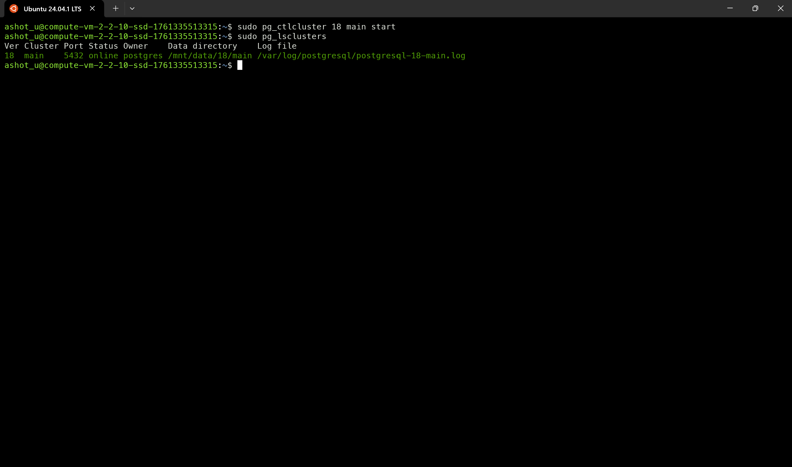

* Подключился к базе данных и проверил, что данные на месте.

```bash
sudo -u postgres psql -p 5432
```
```sql
select * from test;
```

## Задание со звездочкой *
* Остановил кластер на первой виртуальной машине.
* Создал новую виртуальную машину с такими же параметрами, как у первой.
* Установил PostgreSQL и запустил кластер.
* Отсоединил диск от первой ВМ и подключил его ко второй.
* Смонтировал диск, пропустив часть шагов из инструкции по ссылке, так как файловая система уже была создана.
При повторном выполнении команд появлялось предупреждение, что она уже существует.
* Остановил кластер на второй ВМ, удалил файлы из каталога `/var/lib/postgres` и изменил параметр в конфигурационном файле, как на первой ВМ.
* Запустил кластер, подключился к базе данных и убедился, что данные на месте.

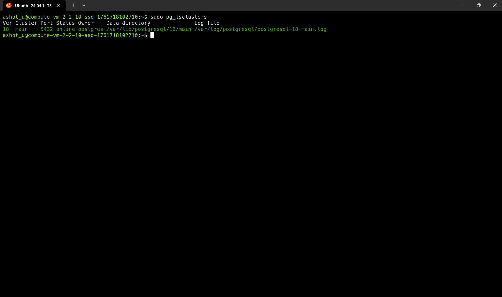
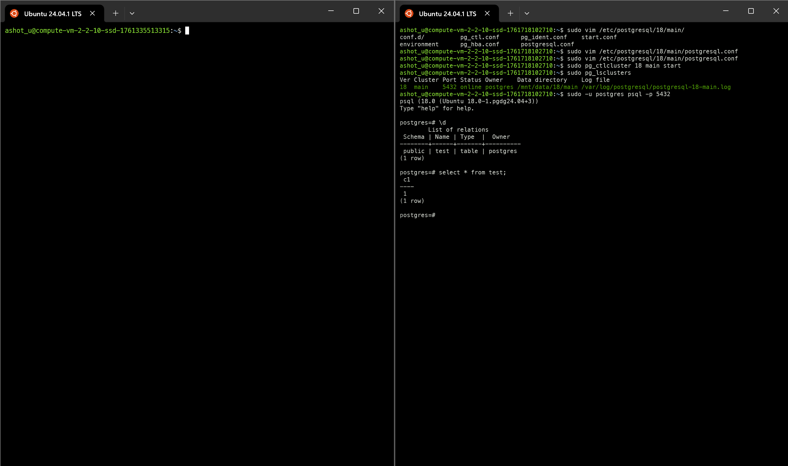

> Получилось, что мы физически перенесли все данные с одного сервера на другой без создания dump-файлов.
> Сначала мы перенесли данные с сервера на внешний диск, убедились, что сервер запустился и данные на месте.
> Затем подключили диск к другому серверу и запустили кластер на новом сервере, не потеряв данные из базы данных.
> 
> Также стоит обратить внимание, что на диске хранятся только данные, без системных и конфигурационных файлов.
> Можно предположить, что таким образом можно сменить операционную систему без особых усилий.
