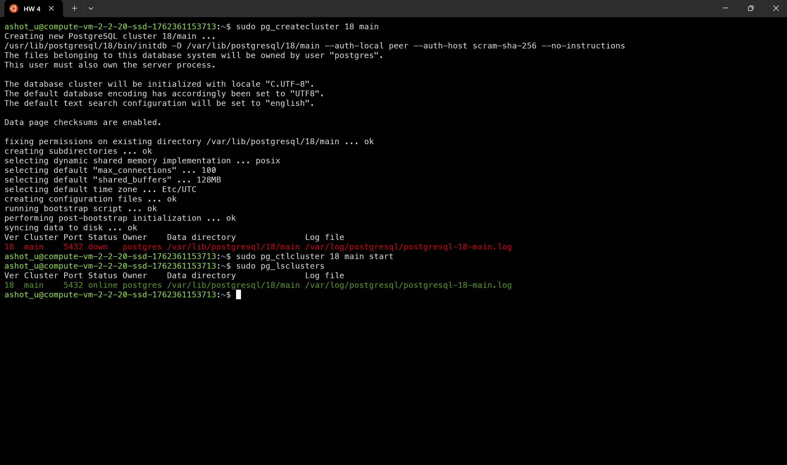
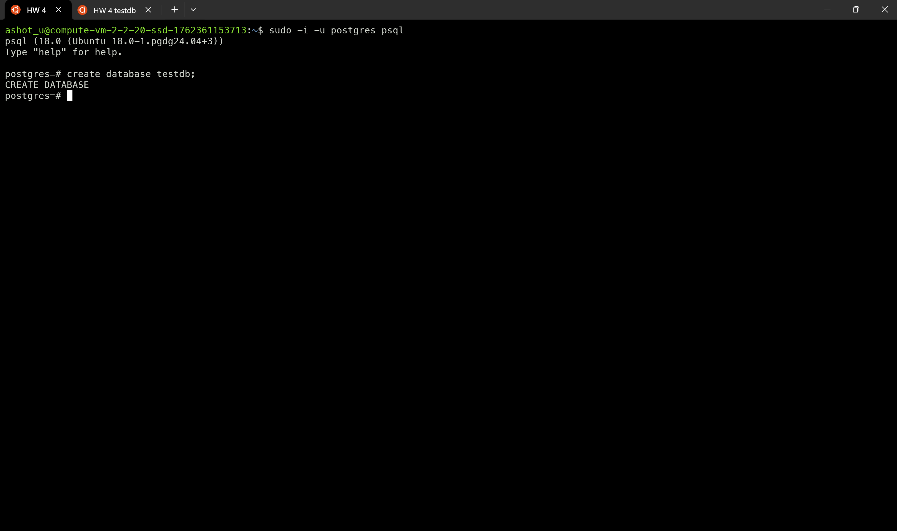
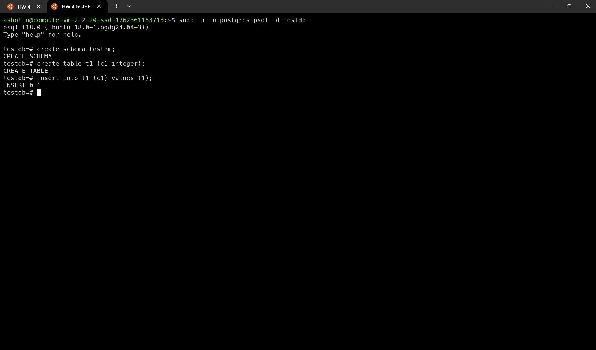
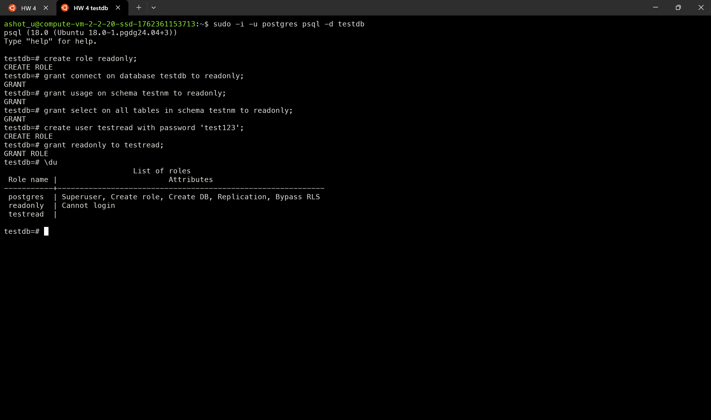
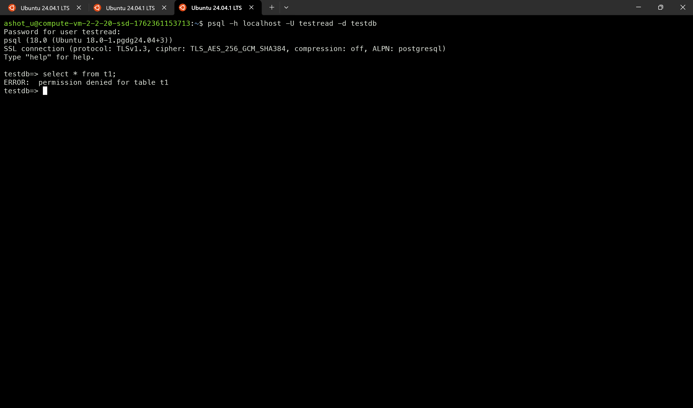
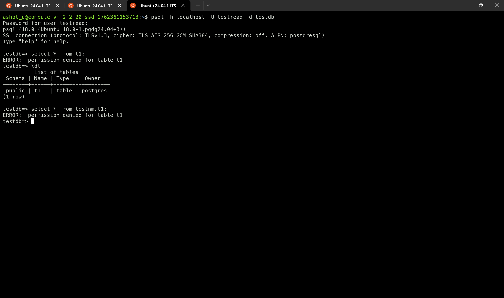
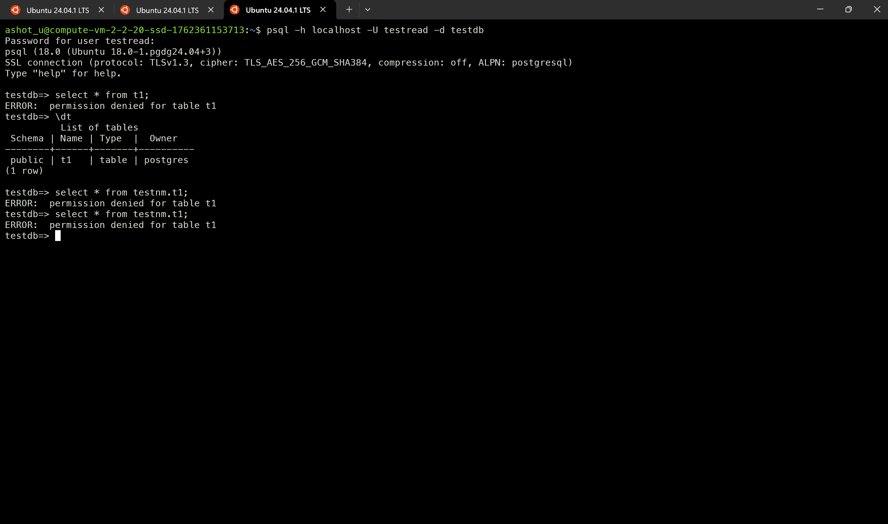
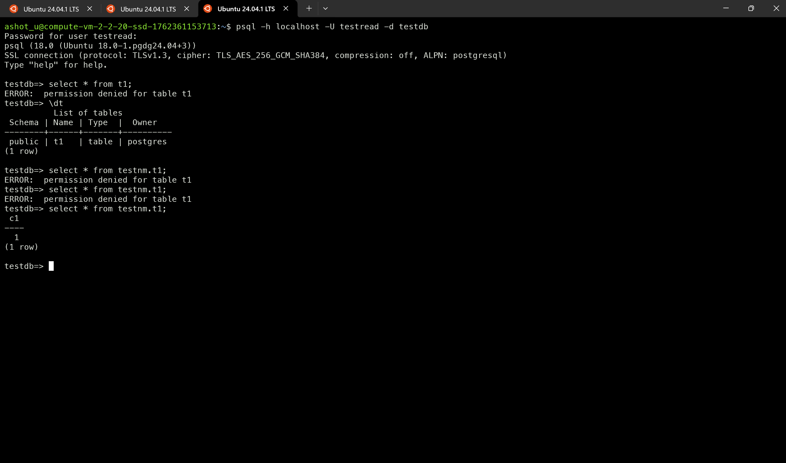
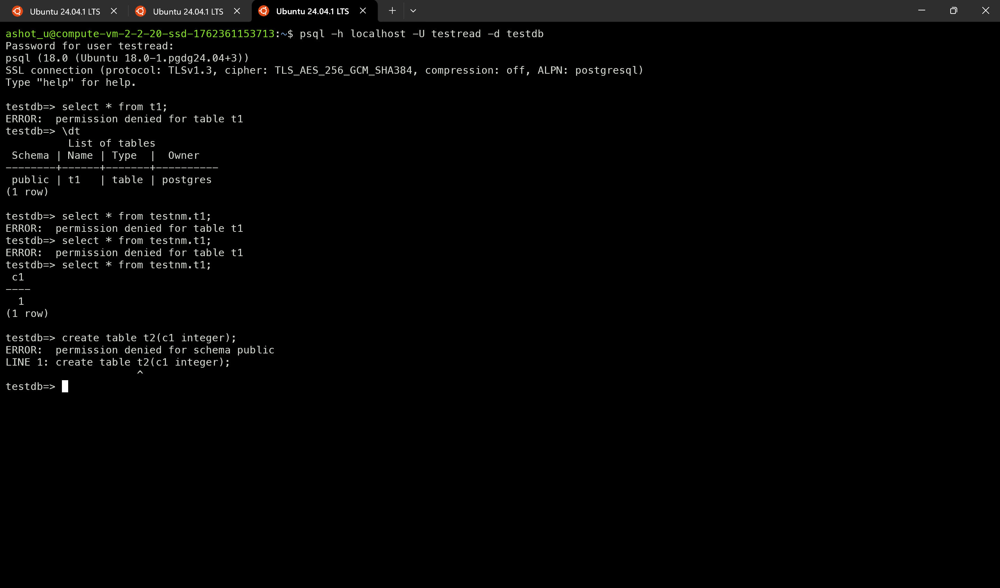

# №4 — Работа с базами данных, пользователями и правами

1. создайте новый кластер PostgresSQL 18

Создал кластер с командами
```bash

sudo pg_createcluster 18 main
sudo pg_ctlcluster 18 main start
sudo pg_lsclusters
```




2. зайдите в созданный кластер под пользователем `postgres`

```bash

sudo -u postgres psql
```

3. создайте новую базу данных `testdb`

```sql
create database testdb;
```



4. зайдите в созданную базу данных под пользователем `postgres`

```bash

sudo -u postgres psql -d testdb
```

5. создайте новую схему `testnm`

```sql
create schema testnm;
```

6. создайте новую таблицу `t1` с одной колонкой `c1` типа `integer`

```sql
create table t1 (c1 integer);
```

7. вставьте строку со значением `c1 = 1`

```sql
insert into t1 (c1) values (1);
```



8. создайте новую роль `readonly`

```sql
create role readonly;
```

9. дайте новой роли право на подключение к базе данных `testdb`

```sql
grant connect on database testdb to readonly;
```

10. дайте новой роли право на использование схемы `testnm`

```sql
grant usage on schema testnm to readonly;
```
11. дайте новой роли право на `select` для всех таблиц схемы `testnm`

```sql
grant select on all tables in schema testnm to readonly;
```

12. создайте пользователя `testread` с паролем `test123`

```sql
create user testread with password 'test123';
```
13. дайте роль `readonly` пользователю `testread`

```sql
grant readonly to testread;
```



14. зайдите под пользователем `testread` в базу данных `testdb`

```bash

psql -h localhost -U testread -d testdb
```
Без указания `-h localhost` не получалось подключиться к базе.

15. сделайте `select * from t1;`
16. получилось?



получил ошибку `ERROR:  permission denied for table t1`

17. напишите что именно произошло в тексте домашнего задания



Получил ошибку `permission denied for relation t1`.

18. у вас есть идеи почему? ведь права то дали?

> Дело в том что, когда мы создавали таблицу,
> мы не указали схему в явном виде, в моем
> случили схема по умолчанию был `public`.
> И таким образом таблица была создана не в схеме `testnm`.

19. посмотрите на список таблиц


Таблица создалась в схеме `public` а не в `testnm`.

20. подсказка в шпаргалке под пунктом 20
21. а почему так получилось с таблицей

22. вернитесь в базу данных `testdb` под пользователем `postgres`
23. удалите таблицу t1

```sql
drop table t1;
```

24. создайте ее заново, но уже с явным указанием имени схемы `testnm`

```sql
create table testnm.t1 (c1 integer);
```

25. вставьте строку со значением `c1 = 1`

```sql
insert into testnm.t1 (c1) values (1);
```

26. зайдите под пользователем `testread` в базу данных `testdb`
27. сделайте `select * from testnm.t1;`


28. получилось?

Не получилось. Выдает ошибку `ERROR:  permission denied for table t1`.

29. есть идеи почему? если нет — смотрите шпаргалку

> Вроде сделал все как указан в описании задачи, идей нет пока что
> посмотрел в шпаргалке.

оказалось что когда делается команда `grant select ...` права получают только существующие таблиц

30. как сделать так чтобы такое больше не повторялось? если нет идей — смотрите шпаргалку

По шпаргалке стало ясно, что я могу дать привилегию по умолчанию для схемы `testnm` и после того
все новые таблицы будут доступны для чтения для роли `readonly`.

```sql
alter default privileges in schema testnm grant select on tables to readonly;
```

31. сделайте `select * from testnm.t1;`
32. получилось?



33. есть идеи почему? если нет — смотрите шпаргалку

> Все еще нет доступа для чтения, потому что только для новых таблиц по умолчанию
> будет доступ для чтения. В этом случили у нас 2 варианта либо пересоздать таблицу,
> либо дать права в ручную.

```sql
grant select on all tables in schema testnm to readonly;
```

34. сделайте `select * from testnm.t1;`
35. получилось?



36. ура!

37. теперь попробуйте выполнить команду `create table t2(c1 integer); insert into t2 values (2);`

> Судя по следующим пунктам, у меня должно было получиться создать таблицу ну у меня получилась ошибка

```
ERROR:  permission denied for schema public
LINE 1: create table t2(c1 integer);
```



38. а как так? нам же никто прав на создание таблиц и `insert` в них под ролью `readonly`? 
39. есть идеи как убрать эти права? если нет - смотрите шпаргалку 
40. если вы справились сами то расскажите что сделали и почему, если смотрели шпаргалку - объясните что сделали и почему выполнив указанные в ней команды 
41. теперь попробуйте выполнить команду `create table t3(c1 integer); insert into t2 values (2);` 
42. расскажите что получилось и почему
